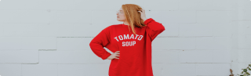

# bpp_shop
A new Flutter project.
## Getting Started
This project is a starting point for a Flutter application.
A few resources to get you started if this is your first Flutter project:
- [Lab: Write your first Flutter app](https://flutter.dev/docs/get-started/codelab)
- [Cookbook: Useful Flutter samples](https://flutter.dev/docs/cookbook)
For help getting started with Flutter, view our
[online documentation](https://flutter.dev/docs), which offers tutorials,
samples, guidance on mobile development, and a full API reference.
// markdown
# Abdul Rahim  
This is __Abdul Rahim__.I am _helpless without Allah_
~~Abdul Rahim~~
```flutter
void main(){
    print("Allah Borosha")
}
```
## Automatic Link
https://www.youtube.com/watch?v=bl0-DTgh-mw&list=PLgH5QX0i9K3qAW8DT6I0XOxC23qnA4FL-&index=12
 
 ## Disable Link 
`https://www.youtube.com/watch?v=bl0-DTgh-mw&list=PLgH5QX0i9K3qAW8DT6I0XOxC23qnA4FL-&index=12`
## Title Link 
 [Bppshop App](https://www.youtube.com/watch?v=bl0-DTgh-mw&list=PLgH5QX0i9K3qAW8DT6I0XOxC23qnA4FL-&index=12)
 ## Image Link
 
 Image.Asset('./assets/banner.png')

 ## Table Syntax 
 | Name |         Email |  
 | ----- | ----|
 |Abdul Rahim | rahimsr98f3@gmail.com|
 |Abdul Rahim | rahimsr98f3@gmail.com|
 |Abdul Rahim | rahimsr98f3@gmail.com|


 
